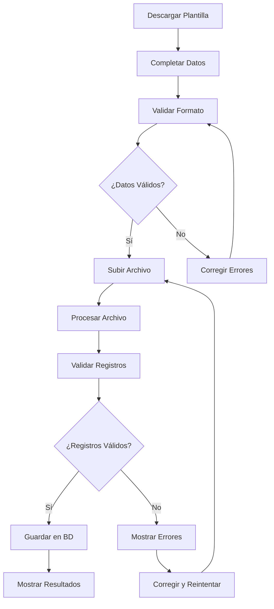

# 📊 Esquema Visual de Carga Masiva

## 🎯 Resumen Ejecutivo

El sistema de planillas multirégimen permite la carga masiva de personal mediante archivos Excel con estructura específica. A continuación se presenta el esquema completo.

---

## 📋 Estructura del Archivo Excel

```
📁 Archivo Excel (.xlsx)
├── 📄 Hoja "Empleados" (Obligatoria si hay empleados)
└── 📄 Hoja "Locadores" (Obligatoria si hay locadores)
```

---

## 👥 Esquema de la Hoja "Empleados"

### Estructura de Columnas

| # | Campo | Tipo | Obligatorio | Ejemplo | Descripción |
|---|-------|------|-------------|---------|-------------|
| A | Nombres | Texto | ✅ | "Juan Carlos" | Nombre(s) del empleado |
| B | Apellidos | Texto | ✅ | "Pérez García" | Apellidos del empleado |
| C | DNI | Texto | ✅ | "12345678" | DNI de 8 dígitos |
| D | Sueldo Base | Número | ✅ | 1500.00 | Sueldo mensual en soles |
| E | Fecha Ingreso | Fecha | ✅ | "2024-01-15" | Fecha formato YYYY-MM-DD |
| F | Tipo Pensión | Texto | ✅ | "ONP" o "AFP" | Tipo de pensión |
| G | AFP Código | Texto | ❌ | "PRIMA" | Solo si Tipo Pensión = "AFP" |
| H | Cuenta Bancaria | Texto | ❌ | "1234567890123456" | Número de cuenta |
| I | Banco | Texto | ❌ | "BCP" | Nombre del banco |
| J | Tipo Pago | Texto | ❌ | "mensual" o "quincenal" | Frecuencia de pago |

### Ejemplo Visual de Datos

```
| Nombres      | Apellidos     | DNI      | Sueldo Base | Fecha Ingreso | Tipo Pensión | AFP Código | Cuenta Bancaria    | Banco      | Tipo Pago |
|--------------|---------------|----------|-------------|---------------|--------------|------------|--------------------|------------|-----------|
| Juan Carlos  | Pérez García  | 12345678 | 1500.00     | 2024-01-15    | ONP          |            | 1234567890123456   | BCP        | mensual   |
| María Elena  | López Silva   | 87654321 | 2000.00     | 2024-02-01    | AFP          | PRIMA      | 9876543210987654   | BBVA       | quincenal |
| Carlos       | Mendoza Vega  | 11223344 | 1800.00     | 2024-03-10    | ONP          |            | 1122334455667788   | SCOTIABANK | mensual   |
```

---

## 💼 Esquema de la Hoja "Locadores"

### Estructura de Columnas

| # | Campo | Tipo | Obligatorio | Ejemplo | Descripción |
|---|-------|------|-------------|---------|-------------|
| A | Nombres | Texto | ✅ | "Ana María" | Nombre(s) del locador |
| B | Apellidos | Texto | ✅ | "Rodríguez Castro" | Apellidos del locador |
| C | DNI | Texto | ✅ | "55667788" | DNI de 8 dígitos |
| D | Monto Mensual | Número | ✅ | 2500.00 | Monto mensual en soles |
| E | Fecha Inicio | Fecha | ✅ | "2024-01-20" | Fecha formato YYYY-MM-DD |
| F | Suspendido | Lógico | ❌ | TRUE o FALSE | Estado del locador |
| G | Cuenta Bancaria | Texto | ❌ | "5566778899001122" | Número de cuenta |
| H | Banco | Texto | ❌ | "BCP" | Nombre del banco |

### Ejemplo Visual de Datos

```
| Nombres      | Apellidos        | DNI      | Monto Mensual | Fecha Inicio | Suspendido | Cuenta Bancaria    | Banco      |
|--------------|------------------|----------|---------------|--------------|------------|--------------------|------------|
| Ana María    | Rodríguez Castro | 55667788 | 2500.00       | 2024-01-20   | FALSE      | 5566778899001122   | BCP        |
| Luis         | Herrera Morales  | 99887766 | 3000.00       | 2024-02-15   | FALSE      | 9988776655443322   | BBVA       |
| Elena        | Díaz Paz         | 44332211 | 2800.00       | 2024-03-05   | TRUE       | 4433221100998877   | SCOTIABANK |
```

---

## ✅ Validaciones por Campo

### Campos Obligatorios (No pueden estar vacíos)

#### Empleados
- ✅ **Nombres**: Texto no vacío
- ✅ **Apellidos**: Texto no vacío  
- ✅ **DNI**: Exactamente 8 dígitos
- ✅ **Sueldo Base**: Número positivo
- ✅ **Fecha Ingreso**: Formato YYYY-MM-DD
- ✅ **Tipo Pensión**: "ONP" o "AFP"

#### Locadores
- ✅ **Nombres**: Texto no vacío
- ✅ **Apellidos**: Texto no vacío
- ✅ **DNI**: Exactamente 8 dígitos
- ✅ **Monto Mensual**: Número positivo
- ✅ **Fecha Inicio**: Formato YYYY-MM-DD

### Campos Opcionales (Pueden estar vacíos)

#### Empleados
- ❓ **AFP Código**: Solo si Tipo Pensión = "AFP"
- ❓ **Cuenta Bancaria**: Número de cuenta bancaria
- ❓ **Banco**: Nombre del banco
- ❓ **Tipo Pago**: "mensual" o "quincenal"

#### Locadores
- ❓ **Suspendido**: TRUE o FALSE
- ❓ **Cuenta Bancaria**: Número de cuenta bancaria
- ❓ **Banco**: Nombre del banco

---

## 🏦 Bancos Soportados

| Código | Nombre Completo |
|--------|-----------------|
| BCP | Banco de Crédito del Perú |
| BBVA | BBVA Continental |
| SCOTIABANK | Scotiabank |
| INTERBANK | Interbank |
| BANBIF | BanBif |
| BANCO PICHINCHA | Banco Pichincha |
| OTRO | Otro banco |

---

## 📅 Formatos de Fecha

### Formato Requerido
```
YYYY-MM-DD
```

### Ejemplos Válidos
- ✅ 2024-01-15
- ✅ 2024-12-31
- ✅ 2023-06-30

### Ejemplos Inválidos
- ❌ 15/01/2024
- ❌ 2024-1-15
- ❌ 15-01-2024

---

## 🔄 Flujo de Carga Masiva



---

## 📊 Estadísticas de Carga

### Límites del Sistema
- **Tamaño máximo**: 16MB
- **Registros por lote**: Sin límite específico
- **Formatos soportados**: Solo .xlsx

### Rendimiento Esperado
- **Empleados**: ~1000 registros por minuto
- **Locadores**: ~1000 registros por minuto
- **Tiempo total**: Depende del tamaño del archivo

---

## 🚨 Errores Comunes y Soluciones

| Error | Causa | Solución |
|-------|-------|----------|
| "No se seleccionó archivo" | No se seleccionó archivo | Seleccionar archivo .xlsx |
| "Archivo debe ser Excel" | Formato incorrecto | Guardar como .xlsx |
| "DNI debe tener 8 dígitos" | DNI inválido | Corregir DNI a 8 dígitos |
| "Tipo Pensión inválido" | Valor incorrecto | Usar "ONP" o "AFP" |
| "Fecha inválida" | Formato incorrecto | Usar YYYY-MM-DD |
| "Error al procesar" | Datos mal formateados | Revisar estructura del archivo |

---

## 📋 Checklist de Validación

### Antes de Cargar
- [ ] Archivo guardado como .xlsx
- [ ] Encabezados en fila 1
- [ ] Sin filas vacías entre datos
- [ ] DNIs con 8 dígitos
- [ ] Fechas en formato YYYY-MM-DD
- [ ] Números sin formato de texto
- [ ] Valores de selección correctos

### Después de Cargar
- [ ] Verificar número de registros cargados
- [ ] Revisar datos en el sistema
- [ ] Confirmar ausencia de errores
- [ ] Probar funcionalidades

---

## 📁 Archivos de Referencia

1. **MANUAL_CARGA_MASIVA.md** - Manual completo detallado
2. **PLANTILLA_CARGA_MASIVA_EJEMPLO.xlsx** - Archivo de ejemplo con datos
3. **ESQUEMA_CARGA_MASIVA.md** - Este documento visual

---

**¡Con este esquema podrás crear archivos de carga masiva perfectos para el sistema de planillas multirégimen!** 🚀
